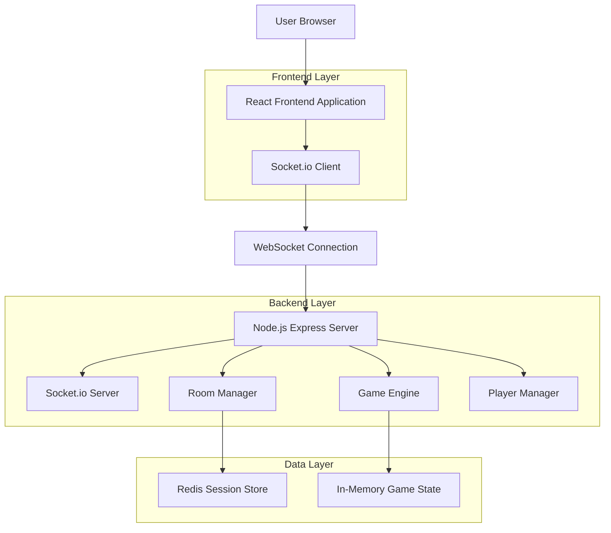
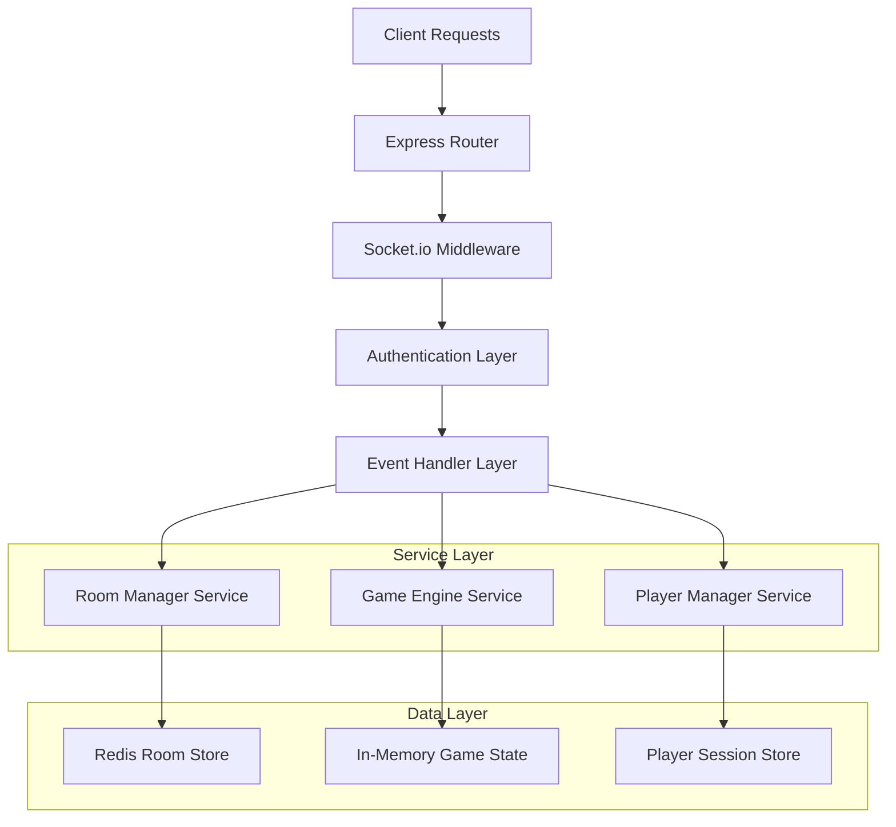
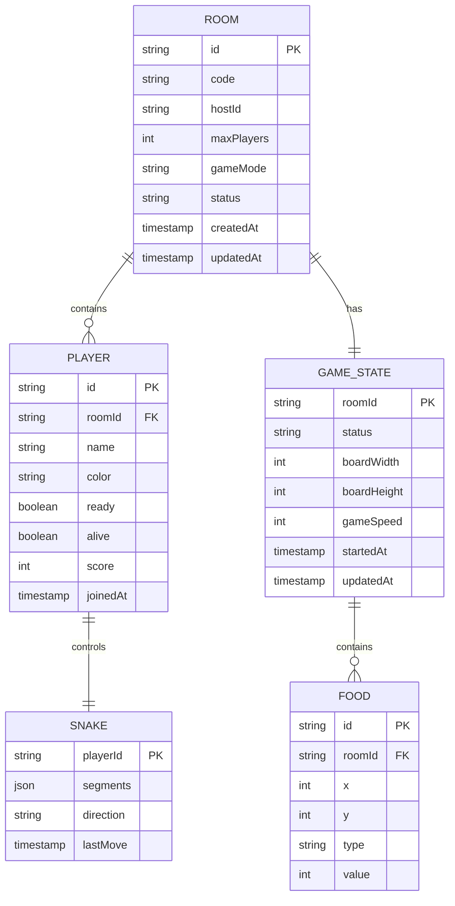

# Multiplayer Snake Game - Technische Architektur

## 1. Architecture Design



## 2. Technology Description

* **Frontend**: React\@18 + TypeScript + Socket.io-client\@4 + Tailwind CSS\@3 + Vite

* **Backend**: Node.js\@18 + Express\@4 + Socket.io\@4 + Redis\@4

* **Development**: Bun als Package Manager und Runtime

* **Deployment**: Docker Container mit WebSocket-Support

## 3. Route Definitions

| Route            | Purpose                               |
| ---------------- | ------------------------------------- |
| /                | Hauptmenü, Raum erstellen/beitreten   |
| /lobby/:roomId   | Lobby-Seite mit Spielerliste und Chat |
| /game/:roomId    | Multiplayer-Spielfeld                 |
| /results/:roomId | Ergebnis-Seite mit Rangliste          |

## 4. API Definitions

### 4.1 WebSocket Events

**Client → Server Events**

```typescript
// Raum-Management
interface JoinRoomEvent {
  roomCode: string;
  playerName: string;
  playerColor: string;
}

interface CreateRoomEvent {
  playerName: string;
  playerColor: string;
  gameSettings: GameSettings;
}

interface GameSettings {
  maxPlayers: number; // 2-4
  gameSpeed: number; // 1-5
  boardSize: 'small' | 'medium' | 'large';
  gameMode: 'classic' | 'battle-royale';
}

// Spiel-Events
interface PlayerInputEvent {
  direction: 'up' | 'down' | 'left' | 'right';
  timestamp: number;
}

interface PlayerReadyEvent {
  ready: boolean;
}

interface ChatMessageEvent {
  message: string;
  timestamp: number;
}
```

**Server → Client Events**

```typescript
// Raum-Updates
interface RoomJoinedEvent {
  roomId: string;
  playerId: string;
  isHost: boolean;
  gameSettings: GameSettings;
}

interface PlayerListUpdateEvent {
  players: Player[];
}

interface Player {
  id: string;
  name: string;
  color: string;
  ready: boolean;
  isHost: boolean;
  score: number;
  alive: boolean;
}

// Spiel-Updates
interface GameStateUpdateEvent {
  gameState: GameState;
  timestamp: number;
}

interface GameState {
  players: PlayerGameState[];
  food: Position[];
  gameStatus: 'waiting' | 'playing' | 'finished';
  timeRemaining?: number;
}

interface PlayerGameState {
  id: string;
  snake: Position[];
  direction: Direction;
  score: number;
  alive: boolean;
}

interface Position {
  x: number;
  y: number;
}

type Direction = 'up' | 'down' | 'left' | 'right';

interface GameEndedEvent {
  results: GameResult[];
  duration: number;
}

interface GameResult {
  playerId: string;
  playerName: string;
  score: number;
  rank: number;
  survivalTime: number;
}
```

### 4.2 REST API Endpoints

**Raum-Informationen**

```
GET /api/room/:roomId/info
```

Response:

```typescript
interface RoomInfo {
  roomId: string;
  playerCount: number;
  maxPlayers: number;
  gameStatus: 'waiting' | 'playing' | 'finished';
  gameSettings: GameSettings;
}
```

**Aktive Räume**

```
GET /api/rooms/active
```

Response:

```typescript
interface ActiveRoomsResponse {
  rooms: RoomInfo[];
  totalRooms: number;
}
```

## 5. Server Architecture Diagram



## 6. Data Model

### 6.1 Data Model Definition



### 6.2 Redis Data Structures

**Raum-Daten**

```typescript
// Redis Key: room:{roomId}
interface RoomData {
  id: string;
  code: string;
  hostId: string;
  players: string[]; // Player IDs
  gameSettings: GameSettings;
  status: 'waiting' | 'playing' | 'finished';
  createdAt: number;
  lastActivity: number;
}

// Redis Key: player:{playerId}
interface PlayerData {
  id: string;
  name: string;
  color: string;
  roomId: string;
  socketId: string;
  ready: boolean;
  joinedAt: number;
}

// Redis Key: game:{roomId}
interface GameData {
  roomId: string;
  state: GameState;
  startedAt: number;
  lastUpdate: number;
}
```

**Session Management**

```typescript
// Redis Key: session:{socketId}
interface SessionData {
  playerId: string;
  roomId: string;
  connectedAt: number;
  lastSeen: number;
}

// Redis Key: room_code:{code}
// Value: roomId (für schnelle Code-zu-Raum Auflösung)
```

## 7. Performance Optimizations

### 7.1 WebSocket Optimizations

* **Delta Compression**: Nur Änderungen im Game State übertragen

* **Client Prediction**: Lokale Bewegungsvorhersage für responsives Gameplay

* **Interpolation**: Smooth Movement zwischen Server-Updates

* **Batching**: Mehrere Events in einem Frame zusammenfassen

### 7.2 Server Optimizations

* **Connection Pooling**: Redis-Verbindungen wiederverwenden

* **Memory Management**: Automatische Raum-Bereinigung nach Inaktivität

* **Load Balancing**: Sticky Sessions für WebSocket-Verbindungen

* **Caching**: Häufig abgerufene Raum-Informationen cachen

### 7.3 Frontend Optimizations

* **Canvas Optimization**: Dirty Rectangle Rendering

* **Event Throttling**: Input-Events auf 60fps begrenzen

* **Memory Management**: Cleanup von Event Listeners

* **Lazy Loading**: Komponenten erst bei Bedarf laden

## 8. Security Considerations

### 8.1 Input Validation

* **Rate Limiting**: Max. 60 Input-Events pro Sekunde pro Spieler

* **Sanitization**: Chat-Nachrichten gegen XSS schützen

* **Validation**: Alle Client-Inputs server-seitig validieren

### 8.2 Anti-Cheat Measures

* **Server Authority**: Alle Spiellogik läuft auf dem Server

* **Input Validation**: Unmögliche Bewegungen abfangen

* **Timing Checks**: Zu schnelle Inputs erkennen und ignorieren

### 8.3 DoS Protection

* **Connection Limits**: Max. Verbindungen pro IP

* **Room Limits**: Max. Räume pro IP pro Zeitraum

* **Message Limits**: Chat-Nachrichten pro Minute begrenzen

## 9. Monitoring & Logging

### 9.1 Metriken

* **WebSocket Latency**: Durchschnittliche Roundtrip-Zeit

* **Active Connections**: Anzahl gleichzeitiger Verbindungen

* **Room Statistics**: Aktive Räume, Spieler pro Raum

* **Game Performance**: Updates pro Sekunde, Memory Usage

### 9.2 Logging

* **Connection Events**: Verbindung, Trennung, Fehler

* **Game Events**: Raum-Erstellung, Spiel-Start/Ende

* **Error Tracking**: WebSocket-Fehler, Game Logic Errors

* **Performance Logs**: Langsame Operationen, Memory Leaks

## 10. Deployment Strategy

### 10.1 Docker Configuration

```dockerfile
# Multi-stage Build für optimale Image-Größe
FROM node:18-alpine AS builder
WORKDIR /app
COPY package.json bun.lockb ./
RUN bun install --frozen-lockfile
COPY . .
RUN bun run build

FROM node:18-alpine AS production
WORKDIR /app
COPY --from=builder /app/dist ./dist
COPY --from=builder /app/node_modules ./node_modules
COPY package.json ./
EXPOSE 3000
CMD ["bun", "start"]
```

### 10.2 Environment Configuration

```typescript
interface EnvironmentConfig {
  PORT: number; // 3000
  REDIS_URL: string;
  NODE_ENV: 'development' | 'production';
  CORS_ORIGIN: string;
  MAX_ROOMS: number; // 1000
  MAX_PLAYERS_PER_ROOM: number; // 4
  ROOM_CLEANUP_INTERVAL: number; // 300000 (5 min)
  GAME_TICK_RATE: number; // 60 (fps)
}
```

### 10.3 Scaling Considerations

* **Horizontal Scaling**: Load Balancer mit Session Affinity

* **Redis Cluster**: Für hohe Verfügbarkeit

* **CDN Integration**: Statische Assets über CDN ausliefern

* **Health Checks**: Kubernetes Readiness/Liveness Probes

