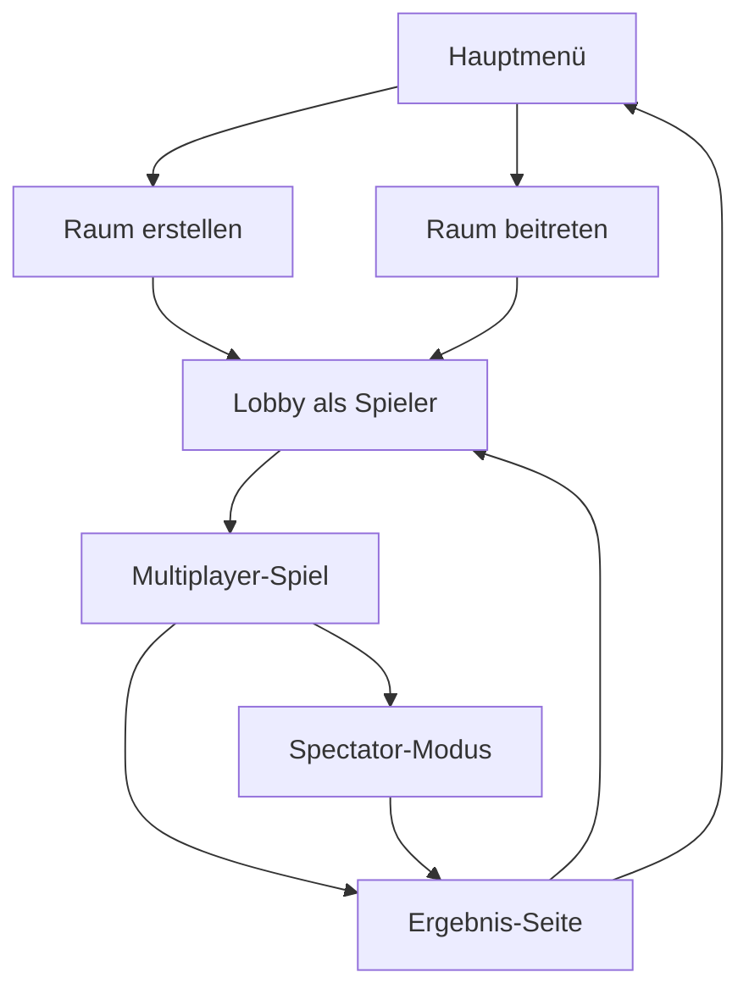
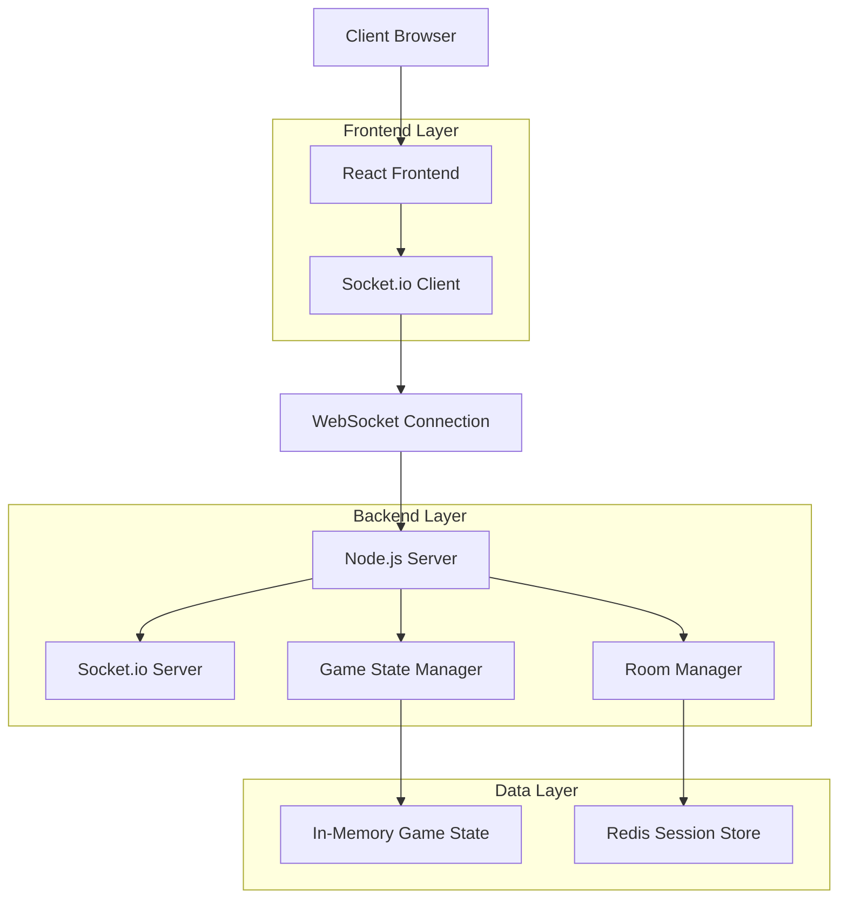

# Multiplayer Snake Game - Produktanforderungsdokument

## 1. Produktübersicht

Transformation des bestehenden Single-Player Snake Games zu einem Echtzeit-Multiplayer-Erlebnis für 2-4 Spieler. Das Spiel behält die bewährte Mechanik bei und erweitert sie um kompetitive und kooperative Multiplayer-Modi.

* **Hauptziel**: Soziales Gaming-Erlebnis durch Echtzeit-Multiplayer-Funktionalität

* **Zielgruppe**: Casual Gamer, die schnelle, kompetitive Spiele mit Freunden suchen

* **Marktwert**: Erhöhung der Spielerbindung durch soziale Interaktion und Wettkampf

## 2. Core Features

### 2.1 User Roles

| Role         | Registration Method | Core Permissions                                      |
| ------------ | ------------------- | ----------------------------------------------------- |
| Gast-Spieler | Nickname-Eingabe    | Kann Räumen beitreten, spielen                        |
| Raum-Host    | Raum erstellen      | Kann Spieleinstellungen ändern, Spiel starten/stoppen |

### 2.2 Feature Module

Unser Multiplayer Snake Game besteht aus folgenden Hauptseiten:

1. **Hauptmenü**: Raum erstellen/beitreten, Nickname-Eingabe, Spielmodus-Auswahl
2. **Lobby-Seite**: Spielerliste, Chat, Spieleinstellungen, Bereitschaftsstatus
3. **Spielfeld**: Multiplayer-Canvas, Live-Scoreboard, Spieler-Avatare
4. **Ergebnis-Seite**: Rangliste, Statistiken, Rematch-Option

### 2.3 Page Details

| Page Name      | Module Name        | Feature description                                                         |
| -------------- | ------------------ | --------------------------------------------------------------------------- |
| Hauptmenü      | Raum-Management    | Erstelle neuen Raum mit Einstellungen, trete bestehendem Raum bei über Code |
| Hauptmenü      | Spieler-Setup      | Eingabe Nickname, Auswahl Schlangen-Farbe, Audio-Einstellungen              |
| Lobby-Seite    | Spielerliste       | Zeige alle verbundenen Spieler, Bereitschaftsstatus, Kick-Funktion für Host |
| Lobby-Seite    | Chat-System        | Echtzeit-Nachrichten zwischen Spielern, Emoji-Support                       |
| Lobby-Seite    | Spieleinstellungen | Spielgeschwindigkeit, Spielfeld-Größe, Spielmodus (Klassisch/Battle Royale) |
| Spielfeld      | Multiplayer-Canvas | Echtzeit-Rendering aller Spieler-Schlangen, Kollisionserkennung             |
| Spielfeld      | Live-Scoreboard    | Aktuelle Punkte, Spieler-Status (lebendig/tot), Platzierung                 |
| Spielfeld      | Spectator-Modus    | Zuschauer-Ansicht für eliminierte Spieler                                   |
| Ergebnis-Seite | Rangliste          | Finale Platzierung, Punkte, Spielstatistiken                                |
| Ergebnis-Seite | Rematch-System     | Neues Spiel starten, Lobby zurückkehren, Spiel verlassen                    |

## 3. Core Process

**Hauptspielablauf:**

1. Spieler gibt Nickname ein und wählt "Raum erstellen" oder "Raum beitreten"
2. Host erstellt Raum und teilt Raum-Code, andere Spieler treten bei
3. In der Lobby konfiguriert Host Spieleinstellungen, alle Spieler markieren sich als bereit
4. Host startet das Spiel, alle Spieler spielen gleichzeitig auf demselben Spielfeld
5. Eliminierte Spieler wechseln in Spectator-Modus
6. Nach Spielende wird Rangliste angezeigt mit Rematch-Option

## 4. User Interface Design

### 4.1 Design Style

* **Primärfarben**: Beibehaltung des bestehenden Farbschemas (#667eea, #764ba2)

* **Sekundärfarben**: Spieler-spezifische Farben (#4ecdc4, #ff6b6b, #ffd93d, #6bcf7f)

* **Button-Stil**: Glasmorphismus mit abgerundeten Ecken, Hover-Effekte

* **Schriftart**: Segoe UI, 16px Basis-Größe, fette Überschriften

* **Layout**: Card-basiert mit zentraler Ausrichtung, responsive Grid-System

* **Icons**: Moderne Emoji-Integration, minimale SVG-Icons für UI-Elemente

### 4.2 Page Design Overview

| Page Name      | Module Name        | UI Elements                                                                               |
| -------------- | ------------------ | ----------------------------------------------------------------------------------------- |
| Hauptmenü      | Raum-Management    | Große Call-to-Action Buttons, Raum-Code Eingabefeld mit Validierung, Glasmorphismus Cards |
| Lobby-Seite    | Spielerliste       | Avatar-Grid mit Farb-Indikatoren, Bereitschafts-Checkboxes, Host-Crown Icon               |
| Lobby-Seite    | Chat-System        | Scrollbarer Chat-Container, Emoji-Picker, Eingabefeld mit Send-Button                     |
| Spielfeld      | Multiplayer-Canvas | Erweiterte Canvas-Größe, Spieler-Nametags, Mini-Map für große Spielfelder                 |
| Spielfeld      | Live-Scoreboard    | Kompakte Sidebar, Echtzeit-Updates, Farbkodierte Spieler-Scores                           |
| Ergebnis-Seite | Rangliste          | Podium-Design für Top 3, Animierte Platzierungs-Enthüllung, Konfetti-Effekt               |

### 4.3 Responsiveness

Mobile-first Ansatz mit Touch-optimierten Controls für Multiplayer-Interaktionen. Adaptive Canvas-Größe je nach Bildschirmgröße, Kollapsible Sidebar für Scoreboard auf kleinen Bildschirmen.

## 5. Technische Architektur

### 5.1 Architektur-Design

### 5.2 Technologie-Stack

* **Frontend**: React\@18 + TypeScript + Vite + Tailwind CSS

* **Backend**: Node.js\@18 + Express\@4 + Socket.io\@4

* **Session Management**: Redis für Raum-Persistierung

* **Deployment**: Docker Container, WebSocket-fähiges Hosting

### 5.3 WebSocket Events

**Client → Server Events:**

* `join-room`: Raum beitreten mit Nickname und Raum-Code

* `create-room`: Neuen Raum erstellen mit Einstellungen

* `player-ready`: Bereitschaftsstatus ändern

* `game-input`: Spieler-Eingaben (Richtungsänderungen)

* `chat-message`: Chat-Nachricht senden

* `start-game`: Spiel starten (nur Host)

**Server → Client Events:**

* `room-joined`: Erfolgreicher Raum-Beitritt

* `player-list-update`: Aktualisierte Spielerliste

* `game-state-update`: Echtzeit-Spielzustand (60fps)

* `game-started`: Spielstart-Signal

* `game-ended`: Spielende mit Ergebnissen

* `chat-message`: Neue Chat-Nachricht

* `player-eliminated`: Spieler-Elimination

### 5.4 Game State Synchronisation

**Authoritative Server Model:**

* Server berechnet alle Spiellogik (Bewegung, Kollision, Futter-Spawning)

* Clients senden nur Input-Events

* 60fps Game State Updates für flüssiges Gameplay

* Client-side Prediction für responsive Eingaben

* Lag-Kompensation durch Interpolation

### 5.5 Skalierbarkeit

* **Horizontale Skalierung**: Load Balancer mit Sticky Sessions

* **Raum-Kapazität**: Max. 4 Spieler pro Raum, unbegrenzte Räume

* **Performance**: Optimierte Collision Detection, Delta-Compression für Updates

* **Monitoring**: WebSocket-Verbindungsstatistiken, Latenz-Tracking

## 6. Implementierungsplan

### Phase 1: Backend-Infrastruktur (Woche 1-2)

* Node.js Server mit Socket.io Setup

* Raum-Management System

* Basis WebSocket Events

* Game State Manager

### Phase 2: Frontend-Integration (Woche 3-4)

* React-Komponenten für Multiplayer-UI

* Socket.io Client Integration

* Lobby und Chat-System

* Responsive Design-Anpassungen

### Phase 3: Game Logic (Woche 5-6)

* Multiplayer-Spiellogik

* Kollisionserkennung für mehrere Spieler

* Echtzeit-Synchronisation

* Spectator-Modus

### Phase 4: Polish & Testing (Woche 7-8)

* Performance-Optimierung

* Cross-Browser Testing

* Latenz-Optimierung

* Deployment und Monitoring

## 7. Erfolgsmetriken

* **Technische KPIs**: WebSocket-Latenz < 50ms, 99.9% Uptime

* **User Experience**: Durchschnittliche Spielsession > 15 Minuten

* **Engagement**: Wiederkehrende Spieler-Rate > 60%

* **Performance**: Unterstützung für 100+ gleichzeitige Räume

